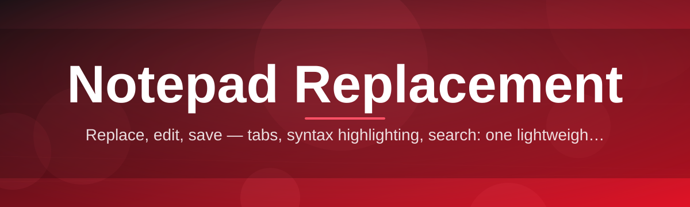
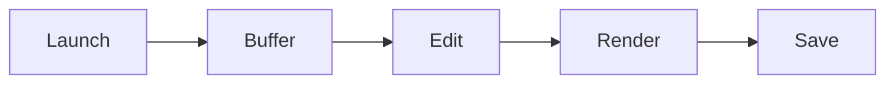

# notepad-replacement-editor 📝⚡

  

*Notepad had 40 years to get good. It didn't. We fixed that.*

  

## 🪦 Overview

Let's be honest — **stock Notepad is a museum exhibit.** It's the digital equivalent of a rotary phone: technically functional, nostalgically charming, and utterly useless the moment you need to actually get work done. No tabs. No search that respects regex. No line numbers. A "Save" dialog that still looks like it's rendering on a CRT.

`notepad-replacement-editor` exists because plain-text editing shouldn't feel like punishment. This is a **lightweight, no-nonsense Windows notepad replacement** built for people who live in `.txt`, `.log`, `.md`, `.ini`, and `.cfg` files all day — sysadmins, developers, writers, note-hoarders, and anyone who's ever screamed internally at losing unsaved text because Notepad crashed without a whisper of autosave.

This isn't a bloated IDE wearing a text-editor costume. It's not Electron duct-taped to a text field either. It's a **fast, native, single-purpose tool** that does one job — editing plain text — and does it with the respect that job deserves in 2026.

---

## 🔥 Why This Wins Arguments at the Water Cooler

> [!TIP]
> Every capability below was born from something stock Notepad *should* have shipped with in 2010.

- **Tabs, finally.** Open twelve files without spawning twelve windows and losing your mind trying to Alt+Tab between them.

- **Regex search that actually works.** Find and replace with real pattern matching — not the "search for exact string only" energy Notepad has clung to since Windows 95.

- **Autosave that doesn't ask permission.** Crash, power outage, cat unplugs your machine — your text survives. No more re-typing that email you almost sent your boss.

- **Instant theme switching.** Light mode for daylight warriors, dark mode for the 2am debugging crowd. No flashbang when you open a new file at midnight.

- **Line numbers & column tracking.** Because "go to line 4,382" is a real request people make, and stock Notepad just shrugs.

- **Drag-and-drop file opening.** Drop a `.log` file onto the window and it just opens. Revolutionary, we know.

- **Zero dependency bloat.** No runtime installs, no background services phoning home, no update nag every six hours.

- **Session restore.** Close it mid-thought, reopen it later, and your tabs, cursor position, and scroll are exactly where you left them.

---

## 🚀 Getting Off Stock Notepad in Under a Minute

1. **Visit the landing page** using the download button above (or below — we're not stingy with buttons).

2. **Download the standalone executable.** No installer wizard interrogating you about telemetry preferences.

3. **Run it.** Double-click. That's the whole ceremony.

4. **Optional:** set it as your default `.txt` handler so Windows stops opening the fossil version automatically.

> [!NOTE]
> Setting a new default text editor on Windows 11 requires going through **Settings → Apps → Default Apps**. This is a Microsoft thing, not a us thing.

---

## 🖥️ System Requirements

| Requirement | Details |
|---|---|
| OS | Windows 10 (64-bit) or Windows 11 |
| Dependencies | None — fully standalone |
| Install footprint | Single portable executable |
| RAM | Practically anything — this isn't Chrome |
| Admin rights | Not required to run |

> [!IMPORTANT]
> This is a Windows-native tool. There is no macOS or Linux build, and there isn't a roadmap promise here either — over-promising cross-platform support is how good tools die slow deaths.

---

## ⚙️ How It Works

The architecture is intentionally boring — boring is fast, boring is stable, boring doesn't crash at 2am.

1. **Launch** — the executable spins up a lightweight native window, no runtime bootstrapping.

2. **Buffer load** — your file (or a blank buffer) is read directly into an in-memory text buffer.

3. **Live editing** — keystrokes mutate the buffer directly; a background timer snapshots it for autosave.

4. **Render** — the display layer paints only the visible viewport, not the entire document, which is why scrolling a 200,000-line log file doesn't choke.

5. **Persist** — on save (manual or auto), the buffer flushes to disk atomically to avoid the classic "half-written file after crash" nightmare.

---

## 🧩 Troubleshooting — Real Questions, Real Answers

<strong>My file won't open — it says "encoding not recognized."</strong>

This usually happens with legacy files saved in obscure codepages. Try re-saving the file as UTF-8 from whatever tool originally created it, then reopen.

<strong>Autosave recovered an old version, not my latest edits.</strong>

Autosave snapshots on an interval, not on every keystroke — if the app was force-killed mid-interval, the very last few seconds of typing might not be captured. This is intentional; snapshotting every keystroke would murder performance.

<strong>Dark mode isn't applying to one specific file tab.</strong>

Check if that tab has a per-file theme override set — it's a niche feature but it exists, and past-you might have flipped it on purpose.

<strong>The app won't set as my default .txt handler.</strong>

That's a Windows permissions quirk, not an app bug. Go through **Settings → Apps → Default Apps → search for .txt** and select it manually.

<strong>Search isn't matching my regex pattern.</strong>

Make sure regex mode is toggled on in the search bar — by default it does plain-text matching so accidental special characters don't break casual searches.

---

## 🎨 UI, UX & The Little Things

**Keyboard shortcuts** — because reaching for a mouse mid-thought is a crime:

| Shortcut | Action |
|---|---|
| `Ctrl + N` | New tab |
| `Ctrl + O` | Open file |
| `Ctrl + S` | Save |
| `Ctrl + Shift + S` | Save As |
| `Ctrl + W` | Close current tab |
| `Ctrl + F` | Find |
| `Ctrl + H` | Find & Replace |
| `Ctrl + G` | Go to line |
| `Ctrl + Z / Y` | Undo / Redo |
| `Ctrl + Tab` | Next tab |
| `Ctrl + Shift + Tab` | Previous tab |
| `Ctrl + Plus / Minus` | Zoom in / out |
| `Ctrl + Shift + D` | Toggle dark mode |
| `F11` | Distraction-free full screen |

**Themes:** Light, Dark, and a High-Contrast mode for accessibility — all switchable instantly without restarting the app.

**Settings persistence:** Your font choice, theme, zoom level, and window size are remembered across sessions — no config file spelunking required.

> [!WARNING]
> Distraction-free mode hides the tab bar entirely. Press `F11` again if you panic and think you've lost your other open files — you haven't.

---

## 🤝 Contributing & Community

This project grows because people who are tired of bad text editors keep showing up with ideas.

- **Found a bug?** Open an issue with steps to reproduce — vague reports get vague fixes.

- **Have a feature idea?** Discussions are open — pitch it, argue for it, convince us.

- **Want to contribute code?** Pull requests are welcome; keep changes focused and describe *why*, not just *what*.

  

> [!TIP]
> Star the repo if this saved you from another Notepad-induced rage moment. It genuinely helps visibility.

---

## 📜 License

Released under the [MIT License](LICENSE), 2026.

Do what you want with it — build on it, fork it, ship it in your own toolchain. Just keep the license notice intact.

---

## ⚠️ Disclaimer

This software is provided **as-is**, without warranty of any kind. The maintainers aren't responsible for lost files, unsaved essays, or emotional damage caused by decades of using stock Notepad before finding this. Always keep backups of anything irreplaceable — that's just good computing hygiene, editor or not.

---

